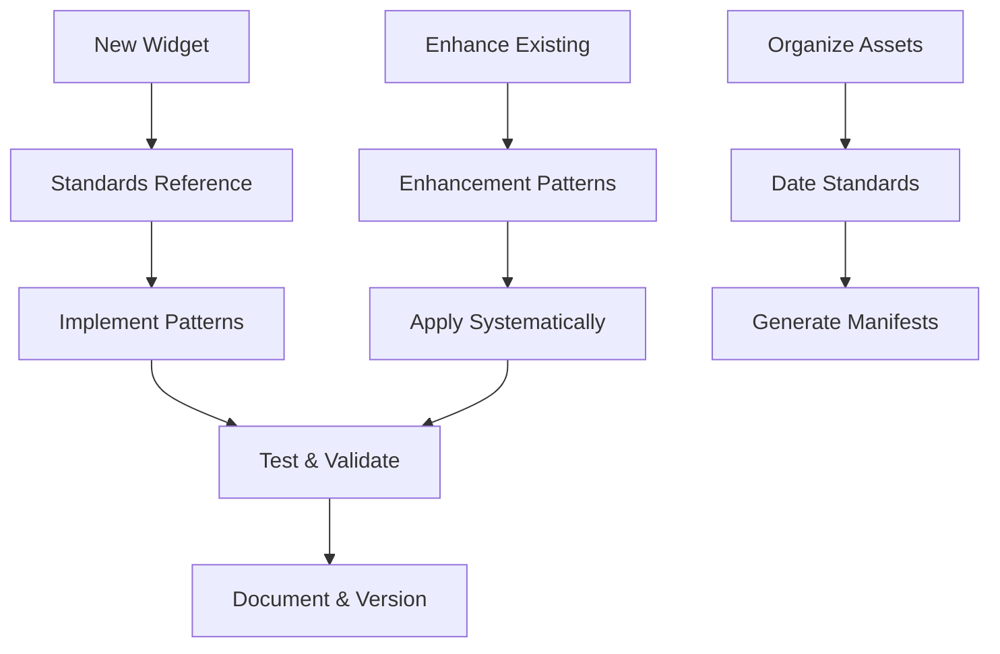

# Standards Documentation

Guidelines, conventions, and best practices for the McCal Media workspace.

## Table of contents

- [Widget Development Standards](#widget-development-standards)
- [Repository Standards](#repository-standards)
- [SEO Standards](#seo-standards)
- [Troubleshooting & Debugging](#troubleshooting--debugging)
- [UI Patterns & Enhancements](#ui-patterns--enhancements)
- [Quick Start Guide](#quick-start-guide)
- [Development Workflow](#development-workflow)

## Widget Development Standards

### 📋 [widget-reference.md](./widget-reference.md) ⭐ START HERE
Quick reference checklist and common patterns for widget development. Essential for daily development.

### ⚡ [performance-standards.md](./performance-standards.md) ⭐ PERFORMANCE FIRST
Lighthouse optimization guide using Concert Portfolio v4.6 as case study. Required reading for all widget development.

### ♿ [accessibility-patterns.md](./accessibility-patterns.md) ⭐ WCAG COMPLIANCE
Comprehensive accessibility pattern library with code examples for skip navigation, focus management, keyboard controls, mobile drawers, scroll spy, ARIA, reduced motion, color contrast, and more. Reference implementation: Accessibility Statement Widget v1.0.

### 📖 [widget-standards.md](./widget-standards.md)
Comprehensive widget standards documentation covering architecture, design patterns, performance, and accessibility requirements.

### 🔄 [widget-development.md](./widget-development.md)
Systematic methodology for applying enhancement patterns across widgets with implementation checklists and quality standards.

## Repository Standards

### 🗂️ [workspace-organization.md](./workspace-organization.md)
Single source of truth for scripts folder structure, archival, workspace validation, and preflight/afterflight checklists.
All contributors must follow this document for any changes to scripts or workspace organization.

### 📅 [date-naming.md](./date-naming.md)
Naming conventions for photo organization and date parsing in manifest generation.

### 🏷️ [versioning.md](./versioning.md)
Semantic versioning guidelines for widgets, manifests, and repository components.

---

## SEO Standards

### 🖼️ [image-seo-standards.md](./image-seo-standards.md)
Comprehensive practices for image alt text, filenames, lazy loading, structured data, and accessibility.

### 🔎 [seo-starter-guide.md](./seo-starter-guide.md)
Practical starter guide tailored for Squarespace implementation in this workspace.

### 🧪 [seo-testing-guide.md](./seo-testing-guide.md)
How to validate SEO with checklists, tools, and repeatable workflows.

---

## Troubleshooting & Debugging

### 🧯 [widget-debugging-lessons.md](./widget-debugging-lessons.md)
Critical lessons and emergency recovery protocols for widget issues (lightbox, performance, regressions).

---

## UI Patterns & Enhancements

### 🎨 [widget-ui-colors-and-buttons.md](./widget-ui-colors-and-buttons.md)
Shared UI patterns for colors, buttons, and minimal, consistent styling.

### ✨ [widget-enhancement-patterns.md](./widget-enhancement-patterns.md)
Catalog of proven enhancement patterns to apply systematically across widgets.

### 🔧 [widget-enhancements.md](./widget-enhancements.md)
Change-oriented enhancements and guidance for improving existing widgets.

---
## Quick Start Guide

### For New Widget Development
1. Read: [widget-reference.md](./widget-reference.md) (quick checklist)
2. Reference: [widget-standards.md](./widget-standards.md) (detailed patterns)
3. Follow: Repository versioning from [versioning.md](./versioning.md)

### For Widget Enhancement  
1. Review: [widget-standards.md](./widget-standards.md) (proven improvements)
2. Apply: [widget-development.md](./widget-development.md) (systematic process)
3. Test: Validate with existing standards

### For Asset Organization
1. Follow: [date-naming.md](./date-naming.md) (photo naming)
2. Version: Use [versioning.md](./versioning.md) guidelines

---

## Development Workflow

---

*These standards ensure consistency, maintainability, and quality across all McCal Media widgets and assets.*